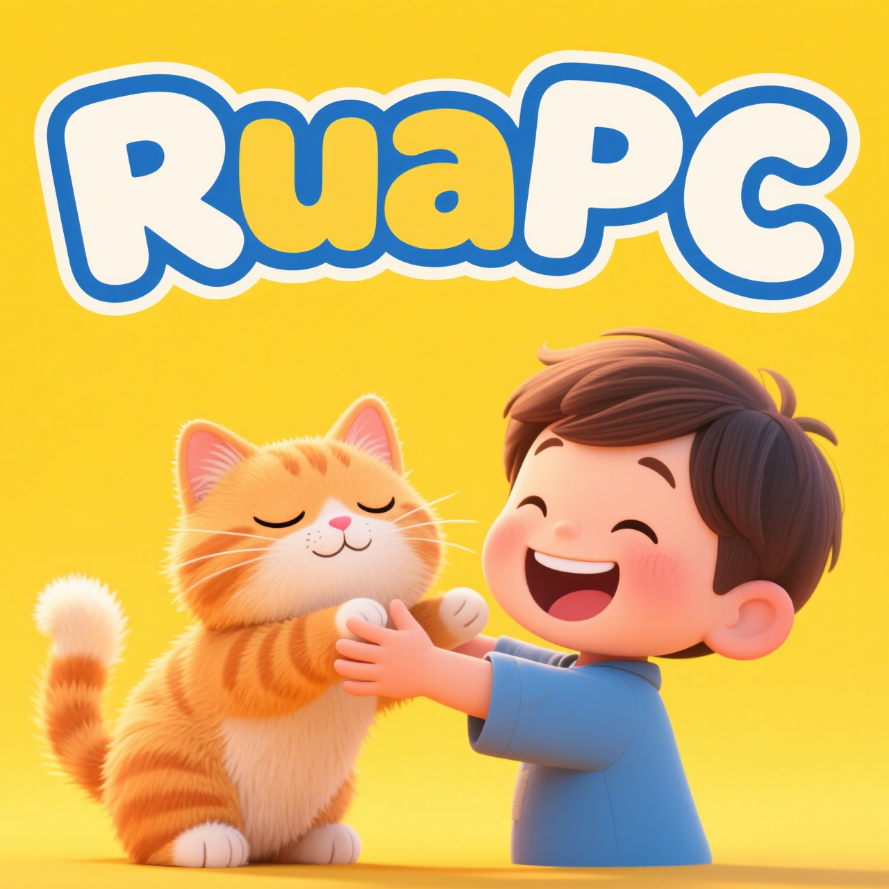

# RuaPC

[](https://github.com/SF-Zhou/ruapc/actions/workflows/rust.yml)
[](https://codecov.io/gh/SF-Zhou/ruapc)
[](https://crates.io/crates/ruapc)
[](https://github.com/mkenney/software-guides/blob/master/STABILITY-BADGES.md#work-in-progress)

A high-performance Rust RPC library that supports multiple transport protocols (TCP, WebSocket, HTTP, RDMA) with unified API, and OpenAPI integration.



## Features

- **Multiple Transport Protocols**: TCP, WebSocket, HTTP, RDMA (optional), and a unified protocol that supports all simultaneously
- **Multiple Serialization Formats**: JSON (default) and MessagePack support
- **OpenAPI Integration**: Automatic OpenAPI 3.0 specification generation with JSON Schema support
- **Built-in Documentation**: RapiDoc integration for interactive API documentation

## Example

Define service:

```rust
#![feature(return_type_notation)]

use ruapc::{Context, Result};
use schemars::JsonSchema;
use serde::{Deserialize, Serialize};

#[derive(Serialize, Deserialize, Debug, Clone, JsonSchema)]
pub struct Request(pub String);

#[ruapc::service]
pub trait EchoService {
    async fn echo(&self, c: &Context, r: &Request) -> Result<String>;
}
```

Start server:

```rust
use ruapc::*;
use ruapc_demo::{EchoService, Request};
use std::{net::SocketAddr, str::FromStr, sync::Arc};

struct DemoImpl;

impl EchoService for DemoImpl {
    async fn echo(&self, _c: &Context, r: &Request) -> Result<String> {
        Ok(r.0.clone())
    }
}

#[tokio::main]
async fn main() {
    let demo = Arc::new(DemoImpl);
    let mut router = Router::default();
    EchoService::ruapc_export(demo.clone(), &mut router);
    let server = Server::create(router, &SocketPoolConfig::default());

    let server = Arc::new(server);
    let addr = SocketAddr::from_str("127.0.0.1:8000").unwrap();
    let addr = server.listen(addr).await.unwrap();
    println!("Serving on {addr}...");
    server.join().await
}
```

Make a request:

```rust
use ruapc::*;
use ruapc_demo::{EchoService, Request};
use std::{net::SocketAddr, str::FromStr};

#[tokio::main]
async fn main() {
    let addr = SocketAddr::from_str("127.0.0.1:8000").unwrap();
    let ctx = Context::create(&SocketPoolConfig::default()).with_addr(addr);
    let client = Client::default();

    let rsp = client.echo(&ctx, &Request("Rua!".into())).await;
    println!("echo rsp: {:?}", rsp);
}
```

## Quick Start

You can directly execute the demo programs provided in ruapc-demo:

### Server

```bash
# Start the server with unified protocol (supports TCP, WebSocket, and HTTP simultaneously)
cargo run --release --bin server -- --socket-type unified

# Or start with specific protocol
cargo run --release --bin server -- --socket-type tcp
cargo run --release --bin server -- --socket-type ws
cargo run --release --bin server -- --socket-type http
```

### Client

```bash
# Stress testing with different protocols
cargo run --release --bin client -- --stress --coroutines 128 --secs 10 --socket-type tcp
cargo run --release --bin client -- --stress --coroutines 128 --secs 10 --socket-type ws
cargo run --release --bin client -- --stress --coroutines 128 --secs 10 --socket-type http

# Or use curl to send HTTP requests.
curl -s -X POST -d '"hello HTTP"' http://0.0.0.0:8000/EchoService/echo | json_pp
#> {
#>    "Ok" : "hello HTTP"
#> }
curl -s -X POST http://0.0.0.0:8000/MetaService/list_methods | json_pp
#> {
#>    "Ok" : [
#>       "EchoService/echo",
#>       "MetaService/list_methods",
#>       "MetaService/openapi",
#>       "GreetService/greet"
#>    ]
#> }

# Access interactive API documentation
open http://0.0.0.0:8000/rapidoc
```

### RDMA Support

```bash
# Make sure the process has unlimited memory lock limit.
sudo prlimit --pid $$ -l=unlimited

# Start the server with RDMA
cargo run --release --bin server --features rdma -- --socket-type unified

# Stress testing with RDMA
cargo run --release --bin client --features rdma -- --stress --coroutines 128
```

## License

This project is dual-licensed under the [MIT License](LICENSE-MIT) and [Apache License 2.0](LICENSE-APACHE).
