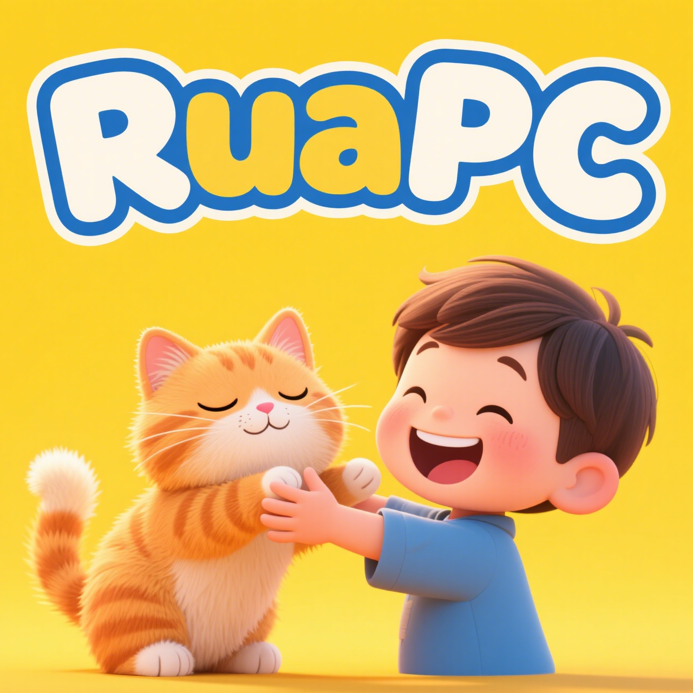

# RuaPC

[](https://github.com/SF-Zhou/ruapc/actions/workflows/rust.yml)
[](https://codecov.io/gh/SF-Zhou/ruapc)
[](https://crates.io/crates/ruapc)
[](https://github.com/mkenney/software-guides/blob/master/STABILITY-BADGES.md#work-in-progress)

A high-performance Rust RPC library that supports multiple transport protocols (TCP, WebSocket, HTTP, RDMA) with unified API, and OpenAPI integration.



## Workspace

| Crate | Description |
|---|---|
| `ruapc` | Core library: server, client, router, socket abstractions, message format |
| `ruapc-bufpool` | Buddy allocator + slab buffer pool with device registration (transport-independent) |
| `ruapc-macro` | Proc macro `#[service]` for service definition and code generation |
| `ruapc-rdma` | Low-level FFI bindings to libibverbs with type-safe RDMA device management |
| `ruapc-demo` | Example server/client applications |

## Features

- **Multiple Transport Protocols**: TCP, WebSocket, HTTP/1.1 and HTTP/2 (h2c), RDMA (optional), and a unified protocol that supports all simultaneously
- **Reverse RPC**: Server can call back into client services over established HTTP/2 or WebSocket connections
- **Remote Read/Write**: Bulk data moves out-of-band through registered buffers ([ruapc-bufpool](ruapc-bufpool/)) instead of inline RPC payloads — one-sided RDMA READs on RDMA, transparent reverse-RPC copies on TCP/WS/HTTP. Clients attach buffers as logical contiguous spaces; servers transfer whole spaces or vectored `CopyOp` batches with offsets. The typed `Result<WithBuffers<T>, E>` contract and client-side buffer pinning make transfers impossible to forget and memory-safe even across timeouts
- **Multiple Serialization Formats**: JSON (default) and MessagePack support
- **OpenAPI Integration**: Automatic OpenAPI 3.0 specification generation with JSON Schema support
- **Built-in Documentation**: RapiDoc integration for interactive API documentation

## Cargo Features

RDMA support is **not** enabled by default (it requires `libibverbs-dev` at build time). Enable it explicitly:

```toml
[dependencies]
ruapc = { version = "0.2.0-alpha.3", features = ["rdma"] }
```

## Example

Define service:

```rust
use ruapc::{Context, Result};
use schemars::JsonSchema;
use serde::{Deserialize, Serialize};

#[derive(Serialize, Deserialize, Debug, Clone, JsonSchema)]
pub struct Request(pub String);

#[ruapc::service]
pub trait EchoService {
    async fn echo(&self, c: &Context, r: &Request) -> Result<String>;
}
```

Start server:

```rust
use ruapc::*;
use ruapc_demo::{EchoService, Request};
use std::{net::SocketAddr, str::FromStr, sync::Arc};

struct DemoImpl;

impl EchoService for DemoImpl {
    async fn echo(&self, _c: &Context, r: &Request) -> Result<String> {
        Ok(r.0.clone())
    }
}

#[tokio::main]
async fn main() {
    let demo = Arc::new(DemoImpl);
    let mut router = Router::default();
    EchoService::ruapc_export(demo.clone(), &mut router);
    let server = Server::create(router, &SocketPoolConfig::default()).unwrap();

    let server = Arc::new(server);
    let addr = SocketAddr::from_str("127.0.0.1:8000").unwrap();
    let addr = server.listen(addr).await.unwrap();
    println!("Serving on {addr}...");
    server.join().await
}
```

Make a request:

```rust
use ruapc::*;
use ruapc_demo::{EchoService, Request};

#[tokio::main]
async fn main() {
    let endpoint: Endpoint = "tcp://127.0.0.1:8000".parse().unwrap();
    let ctx = Context::create(&SocketPoolConfig::default())
        .unwrap()
        .with_endpoint(endpoint);
    let client = Client::default();

    let rsp = client.echo(&ctx, &Request("Rua!".into())).await;
    println!("echo rsp: {:?}", rsp);
}
```

## Quick Start

You can directly execute the demo programs provided in ruapc-demo:

### Server

```bash
# Start the server with unified protocol (supports TCP, WebSocket, and HTTP simultaneously)
cargo run --release --bin server -- --listen-mode unified

# Or start with specific protocol
cargo run --release --bin server -- --listen-mode tcp
cargo run --release --bin server -- --listen-mode ws
cargo run --release --bin server -- --listen-mode http
cargo run --release --bin server -- --listen-mode http --http-base-path /api/v1
```

### Client

```bash
# Stress testing with different protocols
cargo run --release --bin client -- tcp://127.0.0.1:8000 --stress --coroutines 128 --secs 10
cargo run --release --bin client -- ws://127.0.0.1:8000 --stress --coroutines 128 --secs 10
cargo run --release --bin client -- http://127.0.0.1:8000 --stress --coroutines 128 --secs 10

# Or use curl to send HTTP requests.
curl -s -X POST -d '"hello HTTP"' http://0.0.0.0:8000/EchoService/echo | json_pp
#> {
#>    "Ok" : "hello HTTP"
#> }
curl -s -X POST http://0.0.0.0:8000/MetaService/list_methods | json_pp
#> {
#>    "Ok" : [
#>       "EchoService/echo",
#>       "MetaService/list_methods",
#>       "MetaService/openapi",
#>       "GreetService/greet"
#>    ]
#> }

# Access interactive API documentation
open http://0.0.0.0:8000/rapidoc
```

HTTP endpoints can be mounted under a base path on both the server and typed
HTTP clients by using the same socket pool configuration:

```rust
let config = SocketPoolConfig {
    listen_mode: ListenMode::HTTP,
    http_base_path: "/api/v1".into(),
    ..Default::default()
};
```

This exposes RPC methods at `/api/v1/ServiceName/method`, the HTTP/2 RPC
stream at `/api/v1/_rpc`, and API documentation at `/api/v1/rapidoc`.

### Remote Read/Write

Bulk data travels out-of-band through registered buffers, in both
directions and over any transport. The client attaches buffers to a call;
the server reads or writes them by offset:

```rust
use ruapc::*;

#[ruapc::service]
trait BlobService {
    /// Reads the client's buffers, writes the result back into the
    /// client's pre-pinned buffers, and replies with the byte count.
    async fn transform(&self, ctx: &Context, req: &()) -> Result<WithBuffers<u64>>;
}

// ---- Server handler -----------------------------------------------------
impl BlobService for BlobImpl {
    async fn transform(&self, ctx: &Context, _req: &()) -> Result<WithBuffers<u64>> {
        // Pull the client's read space (RDMA READ, or reverse-RPC on TCP).
        let data = ctx.remote_read_all().await?;
        let out = process(data, &ctx.state.buffer_pool);

        // Write into the client's pinned buffers; vectored ops with
        // explicit offsets are available via ctx.remote_write(&ops, bufs).
        let total: u64 = out.iter().map(|b| b.len() as u64).sum();
        let sent = ctx.remote_write_all(out).await?;
        Ok(sent.reply(total)) // response is built *after* the transfer
    }
}

// ---- Client --------------------------------------------------------------
let src = [buf_a, buf_b];              // read space: borrowed for the call
let dst = vec![out_buf];               // write space: pinned until it resolves
let (total, buffers) = client
    .with_read_buffers(&src)
    .with_write_buffers(dst)
    .transform(&ctx, &())
    .await?
    .into_parts();                     // every attached write buffer returns
```

Run the self-contained demo over any transport:

```bash
cargo run --bin remote_memory -- --transport tcp
cargo run --bin remote_memory --features rdma -- --transport rdma
```

### RDMA Support

```bash
# Make sure the process has unlimited memory lock limit.
sudo prlimit --pid $$ -l=unlimited

# Start the server with RDMA
cargo run --release --bin server --features rdma -- --listen-mode unified

# Stress testing with RDMA
cargo run --release --bin client --features rdma -- rdma://127.0.0.1:8000 --stress --coroutines 128
```

### Benchmark

```bash
# End-to-end echo RPC benchmark: serial latency + concurrent throughput
# for every transport (TCP / WebSocket / HTTP / RDMA) on a unified server.
cargo bench -p ruapc --bench echo

# On NUMA machines, pin to the RDMA NIC's node for stable/better numbers:
numactl -N 1 -m 1 cargo bench -p ruapc --bench echo
```

See [docs/benchmark.md](docs/benchmark.md) for details and reference results.

## License

This project is dual-licensed under the [MIT License](LICENSE-MIT) and [Apache License 2.0](LICENSE-APACHE).
