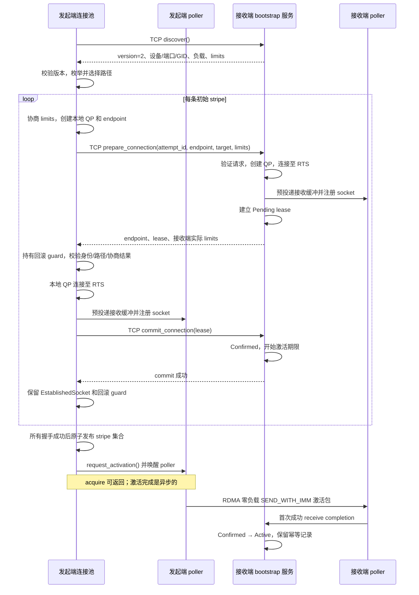

# RDMA 连接建立

RuaPC 通过 **TCP 上的 `_ruapc.rdma` 内部 RPC** 完成设备发现、QP 参数交换和连接确认，再由 RDMA 数据面完成激活。peer 的身份是 bootstrap TCP 地址；每条 stripe 独立选择本地和远端的设备、端口及 GID。

bootstrap 协议版本为 **2**，`discover` 返回的版本必须一致。RPC 字段清单见 [内置服务](builtin-services.md)；CQ 资源预留见 [RDMA 容量](rdma-capacity.md)。

## 模块职责

路径均相对于仓库根目录。

| 模块 | 职责 |
|---|---|
| `ruapc/src/rdma/rdma_service.rs` | 内部 RPC 接口、协议版本和可连接设备的 advertisement。 |
| `ruapc/src/rdma/endpoint.rs` | Wire 类型、端点验证、双向资源协商和 prepare 响应校验。 |
| `ruapc/src/rdma/rdma_socket_pool/placement.rs` | 枚举候选路径，按静态策略、负载和失败记录选择路径。 |
| `ruapc/src/rdma/rdma_socket_pool/connect.rs` | 缓存 discovery、路径切换、构建并发布 stripe 集合。 |
| `ruapc/src/rdma/rdma_socket_pool/handshake.rs` | 单条连接的 prepare → 交换 → 本地连接/注册 → commit，以及发布前的回滚所有权。 |
| `ruapc/src/rdma/rdma_socket_pool/setup.rs` | 两端共用的资源协商、poller/QP 创建、端点生成、QP 连接和 socket 注册。 |
| `ruapc/src/rdma/rdma_socket_pool/accept.rs` | 接收端 prepare/commit/cancel、lease 状态机和过期清理。 |
| `ruapc-rdma/src/verbs/qp_connection.rs`、`ruapc-rdma/src/verbs/queue_pair.rs` | 连接参数验证、verbs 属性生成及 RESET → INIT → RTR → RTS。 |
| `ruapc/src/rdma/poller/conn.rs` | 异步发送激活包、观察成功接收、处理 completion 错误。 |

## 完整时序

下面展示首次建立一个 peer 的流程；已有健康 stripe 时通常直接复用，补连接和迁移复用相同的单条握手。



QP 到 RTS 表示 NIC 接受了本地配置，**不保证远端可达**。TCP commit 确认发起端持有本地 QP；无路由等问题可能到激活 SEND 的 completion 才出现。发布和 acquire 返回均不等待数据面激活。接收端以首次成功接收为依据，激活包或正常流量都可触发。

一次握手失败后可尝试其他候选；本地 QP 连接失败会将该 peer 的 NIC 对记录为 30 秒失败路径。advertisement 缓存也为 30 秒；prepare RPC、prepare 响应验证或路径枚举失败会使缓存失效，供后续发现刷新。

## 路径策略与维护

以下配置均位于 `SocketPoolConfig.rdma`。设备集合在创建 context 时确定；需要不同策略时创建独立 context。

| `path` 配置 | 行为 |
|---|---|
| `device_filter` | 非空时仅保留所列本地设备。 |
| `device_exclude` | 排除所列设备，优先于 `device_filter`。 |
| `allow_down_ports` | 默认 `false`；启用后保留含 DOWN 端口的设备，供恢复后使用，DOWN 端口本身仍不可选。 |
| `subnets` | CIDR 二维列表；每个内层列表是一个连接域，两端 NIC 地址分别落在该域的任意 CIDR 中即匹配。 |
| `subnet_policy` | 默认 `prefer`：有匹配路径时优先，否则回退；`require`：只允许匹配路径，空域配置也无法匹配。 |

连接域策略只由连接发起端执行；接收端不按自己的 `subnets` 再匹配。
在候选路径中先应用连接域策略，再按 InfiniBand、RoCE v2、其他 RoCE 的顺序选择链路类别，最后比较负载。
远端 NIC 随机选两个候选并取较轻者，负载使用 advertisement 的连接数加本端已有健康 stripe 数；
随后在能连接该远端的本地 NIC 中选连接数最少者，本地计数包括出站和入站连接。
这些规则筛选候选，不能证明网络可达。

`maintenance.interval_ms` 默认 5000，按 0.5–1.5 倍抖动运行；设为 0 关闭连接池维护。
设备属性由独立任务每 15 秒刷新，维护据此关闭本地端口已失效的连接并清理死亡 stripe。
对仍有连接或近期使用的 peer，先补足每个远端 NIC 的覆盖，再补足连接总目标：
`peers.min_connections_per_remote_nic` 和 `peers.connections_per_peer` 均默认 1，
补连受 `peers.preconnect_max_per_peer`（默认 16）和失败退避限制。
维护逐步平衡负载；改善达到 `maintenance.rebalance_threshold`（默认 2）时才考虑迁移，
先建立并发布替代连接，再把旧连接移入 draining，经过 `maintenance.drain_timeout_ms`（默认 10000）的宽限期关闭。

`State::rdma_path_report()`（服务端可经 `Server::state()` 访问）返回每条路径的 NIC 对、方向、QP、健康和 active/draining 阶段，以及各设备连接数和 CQ 预算。
实现见 `rdma_socket_pool/placement.rs`、`maintenance.rs`、`report.rs`；CQ 字段见 [RDMA 容量](rdma-capacity.md#introspection-and-implementation)。

## 参数协商与验证

设发起端的配置与设备能力交集为 `L`，接收端 advertisement 为 `R`。发起端先算出：

```text
send = min(L.max_send_wr, R.max_recv_wr)
recv = min(L.max_recv_wr, R.max_send_wr)
ring = min(L.recv_queue_len, R.recv_queue_len, send, recv)
message = min(L.max_msg_size, R.max_msg_size)
```

`PrepareConnectionRequest.limits` 携带这组已解析的值。接收端按自身当前能力再次协商，并通过 `PrepareConnectionResponse.limits` 返回实际配置。发起端要求接收端的 `max_send_wr` 等于自己的 `max_recv_wr`、反向亦然，且 `recv_queue_len`、`max_msg_size` 完全一致；若发现后能力已改变，握手失败并回滚，避免两端使用不同的缓冲大小或流控窗口。

| 字段 | 规则 |
|---|---|
| `recv_queue_len` | 至少 2，且不超过协商后的任一方向 WR 数；发送信用窗口为其一半。 |
| `max_msg_size` | 两端取小，至少 16 KiB。 |
| `qp_num`、`psn` | 24 位；QP 号必须非零，PSN 按 QP 随机生成，可以为零。 |
| `port_num`、`gid_index` | 端口从 1 开始；prepare 响应必须对应请求中的目标端口和 GID index。 |
| `link_layer`、`lid`、`gid` | 两端链路类型一致；IB 使用有效单播 LID，可无 GID；RoCE 使用非零单播 GID。 |
| `active_mtu` | Wire 枚举仅允许 verbs 的 256–4096 字节 MTU；路径取双方较小值。 |
| `rd_atomic_cap` | 1–16，取双方较小值，同时配置 `max_rd_atomic` 和 `max_dest_rd_atomic`。 |
| `traffic_class` | 由发起端选择，接收端沿用。 |
| `attempt_id`、`accepted_connection_id` | 均非零，响应 attempt 必须匹配请求；共同定位一次接收端连接。 |

SGE 上限、P_Key index、选择性 signaling 和 CQ 配置留在各端本地；CQ 按设备分片，不参与连接级 wire 协商。lease 标识关联生命周期，不是认证凭据；bootstrap 服务假定控制面可信。

## Lease 状态与期限

`rdma.peers.connect_lease_ms` 默认 30 秒，最小 15 秒。准备期限、激活期限、Active 幂等记录的保留期分别使用这个时长。

| 状态 | 已观察到的事件 | 期限与到期动作 |
|---|---|---|
| `Pending` | prepare 完成 | 从 prepare 完成计时；到期关闭未激活连接。 |
| `ReceiveObserved` | 首次成功接收，尚无 commit | 沿用准备期限；接收事件不续期，到期关闭。 |
| `Confirmed` | 首次 commit，尚无成功接收 | 从首次 commit 开始计激活期限；到期关闭。 |
| `Active` | commit 和成功接收均已到达，顺序不限 | 从进入 Active 开始保留幂等记录；到期仅忘记记录，不关闭连接。 |

重复 commit/receive 不延长任何期限。commit 在有效 lease 或 Active 记录保留期间幂等；记录不存在、身份不匹配、已过期或 socket 已关闭时返回明确错误。`cancel_connection` 按完整身份匹配，重复取消或找不到记录时无操作；匹配时关闭对应 socket，包括尚在幂等保留期内的 Active 连接。

独立 sweeper 按 `clamp(connect_lease_ms / 4, 100ms, 1s)` 检查；commit、首次 receive 和重复 prepare 也会检查过期。Active 记录过期的所有路径都只移除记录。

## 期限、回滚与发布

连接的总体 deadline 贯穿 discovery、路径尝试和每条握手。bootstrap 客户端的连接超时与 RPC 响应超时均为 5 秒，并受剩余 deadline 限制；commit 响应超时时，若总体预算仍有剩余，额外重试一次。

prepare 返回属于本次尝试的有效 lease 后，`BootstrapRollback` 持有远端清理责任；本地 socket 注册后也由它负责失败关闭。握手报错、future 被取消，或已握手的 stripe 最终未发布，都会触发 guard：将本地 QP 置为 ERR，并以独立于已过期请求的清理 context 尝试 TCP cancel。cancel 失败、任务监督器已停止，或 prepare 响应丢失导致拿不到 lease 时，接收端的有限 lease 负责回收。

首次建立 `connections_per_peer` 条 stripe 时，所有 `EstablishedSocket` 保留回滚 guard，直到每条握手都成功且发布前健康检查通过，才一次替换 `active` 集合。任一条失败会回滚此前尚未发布的连接。持有发布锁时依次关联 peer 健康跟踪、解除回滚、写入可选集合，释放锁后请求异步激活；因此 poller 的自动激活不会抢在发布之前发送。迁移也在替代连接握手成功后更新集合，再排空旧连接。

## 日志定位

应用安装支持 `EnvFilter` 的 tracing subscriber 后，可用 `RUST_LOG=ruapc::rdma=debug` 查看阶段日志。首先用 `attempt_id` 关联两端 bootstrap，再用各端 `conn_id` 和 `local_qp` 追踪 poller；两端的连接 ID 不相同，prepare 响应中的 `accepted_connection_id` 是接收端 ID。

| 位置或消息 | 重点字段与含义 |
|---|---|
| `rdma_connect` span | `peer`、`attempt_id`、两端设备/端口/GID index、QP、本地 `conn_id`；覆盖单次路径尝试。 |
| `rdma.accept.prepare` span | 接收端以相同 `attempt_id` 记录所选设备和远端 QP。 |
| `RDMA local endpoint prepared` | 完整 endpoint 和协商后 config，可核对 MTU、PSN、READ cap 及队列大小。 |
| `RDMA connection attempt failed` | `error_kind`、阶段上下文和 `elapsed_ms`；区分 prepare、验证、QP 连接、注册和 commit。discovery 失败在返回错误中包含 peer 和发现阶段。 |
| `ibv_modify_qp failed` 错误 | RESET→INIT / INIT→RTR / RTR→RTS 阶段、目标状态、属性 mask、provider 实际返回的 errno 及连接参数。 |
| `RDMA connection confirmed; awaiting publication` | 控制面确认成功；尚未发布或验证数据面。 |
| `RDMA ... published; activation requested` | 已进入连接池；激活仍由 poller 异步完成。 |
| `RDMA accept lease expired before activation` | `attempt_id`、`conn_id`、状态、QP 和路径；区分缺少 commit 还是缺少 receive。 |
| `RDMA work completion failed; closing connection` | `conn_id`、QP、路径、WR ID、completion status、`vendor_err`；可达性问题常从首次激活 SEND 暴露。 |
| `rdma_bootstrap_cancel` span | 未发布连接回滚；若 peer cleanup 失败，后续依赖接收端 lease 过期。 |

阶段包装保留原始 `ErrorKind`；QP verbs 错误通过 `RdmaError` 保留底层类别，CQ 预算不足返回 `Overloaded`。先查首个阶段或 completion 失败，再查关闭与 lease 日志；后续 flush completion 不重复记录错误。QP 身份、完成证据与资源释放顺序见 [WRID 所有权](wrid.md)。
